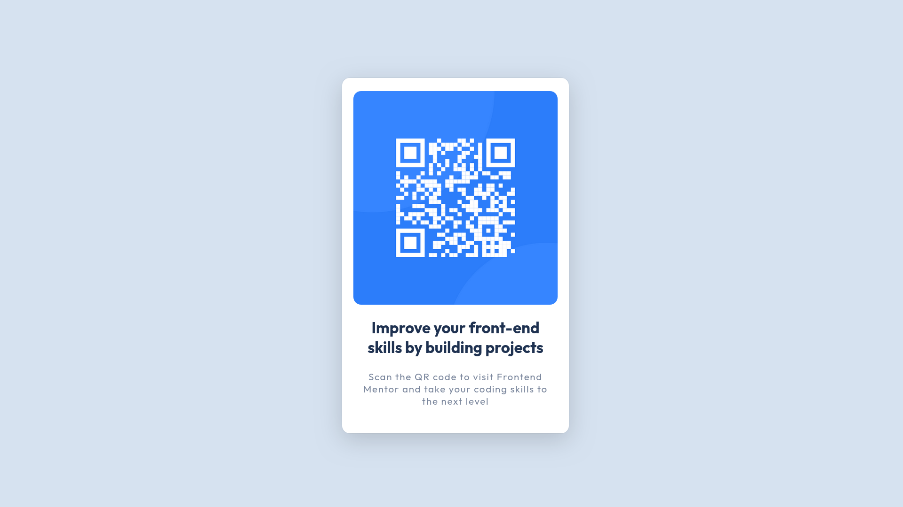

# Frontend Mentor - QR code component solution

This is a solution to the [QR code component challenge on Frontend Mentor](https://www.frontendmentor.io/challenges/qr-code-component-iux_sIO_H). Frontend Mentor challenges help you improve your coding skills by building realistic projects.

### Live version [here](https://mannyoii.github.io/qr-code-component-main/)

### Screenshot

### Links

- Solution URL: [Add solution URL here](https://github.com/mannyoii/qr-code-component-main)
- Live Site URL: [Add live site URL here](https://mannyoii.github.io/qr-code-component-main/)

## My process

- Started with the HTML structure first and then styling with the CSS, with responsive design in mind.

### Built with

- Semantic HTML5 markup
- CSS custom properties
- Flexbox
- Mobile-first workflow

### What I learned

- The layouts and positioning.

## Author

- Website - [Add your name here](https://www.your-site.com)
- Frontend Mentor - [@yourusername](https://www.frontendmentor.io/profile/yourusername)
- Twitter - [@yourusername](https://www.twitter.com/yourusername)
